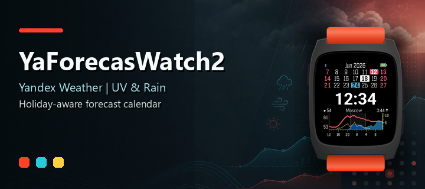
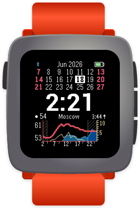
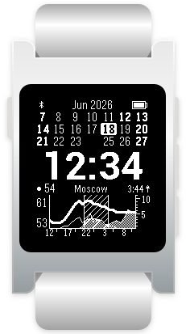
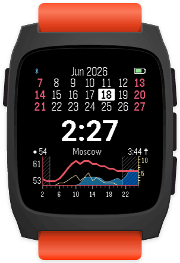

## About this fork

This fork is published as **YaForecasWatch2**, a modified ForecasWatch2 build focused on making the watchface more useful outside the original Weather Underground/OpenWeatherMap flow.

Changes relative to the original ForecasWatch2 watchface:

- Added **Yandex Weather** as a third main weather provider.
- Added **Open-Meteo supplements** for Yandex Weather rain probability and UV index graphs, because those fields are not available in the Yandex Weather Smart Home free tier.
- Changed the Yandex Weather refresh interval to **60 minutes**, matching the free-tier daily request limit more closely.
- Added **two configurable holiday sets**, with support for US, Russia, Spain national holidays, and Spain national + Catalonia holidays.
- Holiday data is fetched from **Nager.Date**, cached locally for 30 days, and sent to the watch as compact yearly bitsets so the calendar still works offline.
- Overlapping holidays from two selected sets are shown with a **split-color date highlight** on color Pebble watches.
- Added a separate **YaForecasWatch2-debug** build profile with copyable diagnostic logs in settings for weather fetches, Open-Meteo supplements, and Nager.Date holiday sync.
- Added a unique app UUID/display name and source-code URL metadata for clean redistribution of this GPL-licensed modified version.
- Added Pebble Time 2 / Emery layout fixes and screenshot/dev tooling improvements used while maintaining this fork.

The current source for this fork is available at:

https://github.com/Dreamkeeper/YaForecasWatch2

## Original ForecasWatch2 description

Open source revival of the beloved ForecasWatch watchface. This includes support for Weather Underground forecasts, which broke on the original ForecasWatch when the free API was shut down. Feel free to contribute or suggest improvements on GitHub!

## Screenshots

| Pebble Time | Pebble 2 Duo | Pebble Time 2 |
| --- | --- | --- |
|  |  |  |

## Features

* Current time
* Battery indicator
* 3 week calendar
* 24 hour weather forecast (updates every 30 minutes)
* Bluetooth connection indicator
* Vibrate on disconnect
* Quiet time indicator
* Night shading
* Multiple weather providers (Weather Underground*, OpenWeatherMap, Yandex Weather)
* Current temperature
* Temperature forecast (red line)
* UV index forecast (yellow line)
* Precipitation probability forecast (blue area)
* City where forecast was fetched
* Next sunrise or sunset time
* GPS or manual location entry
* Fahrenheit and Celsius temperatures
* Customize time font and color
* Customize colors for Sundays, Saturdays, and up to two holiday sets
* Offline configuration page

*\* Using a hacky workaround*

## Weather providers

ForecasWatch2 can fetch weather from:

- Weather Underground
- OpenWeatherMap
- Yandex Weather

Yandex Weather support is intended to work with the Yandex Weather Smart Home API tier. That tier provides current temperature, feels-like temperature, wind speed, weather conditions, and condition icons. It does not currently expose precipitation probability or UV index fields, so when Yandex Weather is selected ForecasWatch2 supplements only those graph series with Open-Meteo data for the same location.

This means the watchface can still show the normal temperature, rain probability, and UV index graphs while using Yandex Weather as the main provider.

## Holiday calendar

YaForecasWatch2 can highlight up to two holiday sets at once:

- US holidays
- Russian holidays
- Spanish national holidays
- Spanish national holidays + Catalonia holidays

Holiday data comes from [Nager.Date](https://date.nager.at/). The phone app caches each selected holiday calendar for 30 days in local storage, sends the current/previous/next year to the watch as compact bitsets, and keeps using stale cached data if a refresh fails. This keeps the calendar usable even when the phone is offline.

When both selected holiday sets match the same date, color watches show a split-color highlight. Black-and-white watches use bold holiday dates.

## Platforms

All rectangular watches are supported (Classic, Steel, Time, Time Steel, Pebble 2).

## Installation

Download the latest production or debug `.pbw` from [GitHub Releases](https://github.com/Dreamkeeper/YaForecasWatch2/releases/latest), then sideload it with a Pebble-compatible phone app.

## Developers

See [CONTRIBUTING.md](CONTRIBUTING.md) for developer setup and workflow.

### Continuing development with Codex

This repo is prepared for Codex-assisted development:

- Root-level [AGENTS.md](AGENTS.md) contains project-specific instructions Codex should follow.
- [CONTRIBUTING.md](CONTRIBUTING.md) documents the build, emulator, fixture, and screenshot workflows.
- Tool versions are pinned in [mise.toml](mise.toml) and [mise.lock](mise.lock).
- Deterministic UI fixtures live in [fixtures/](fixtures/), which makes visual work easier to reproduce.

For a new fork, install the repo tools with `mise install`, run `npm install`, then ask Codex to inspect `AGENTS.md`, `CONTRIBUTING.md`, and the relevant source files before making changes.

## Telemetry

YaForecasWatch2 does not send telemetry. The fork keeps local debug logging for troubleshooting, but no weather fetches, settings, account tokens, watch tokens, location data, or device metadata are uploaded by production or debug builds.
